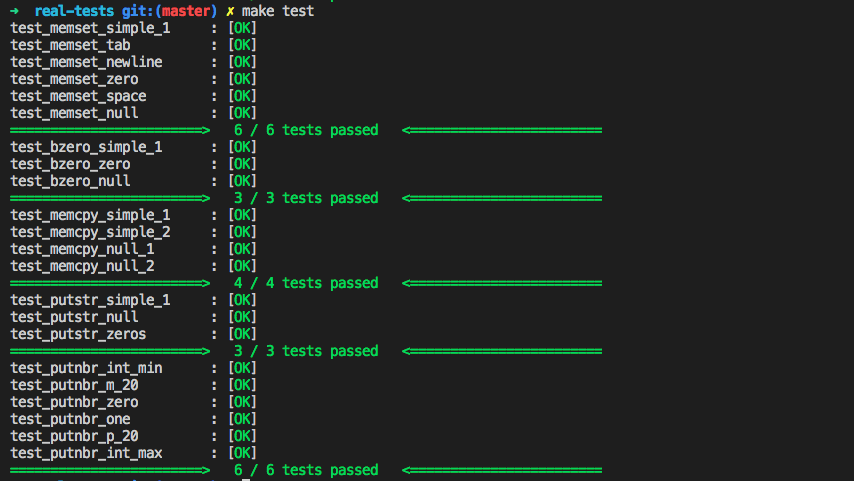

# libunit

Libunit est un sujet de rush de 42 qui consiste a recréer une librairie de tests unitaires pour les fonctions en C. Cette librairie doit gérer les différents comportements de fonctions sans crasher et signaler quand la fonction crash (segmentation fault, abort ...) ou que le test est réussi.

