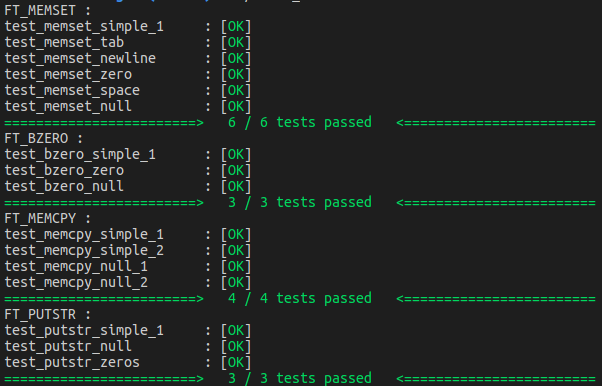
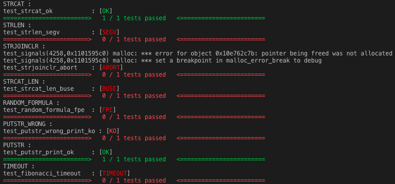

# Libunit (42 rush)



Libunit is a 42 rush project (project realised on a week-end) consisting in building a library for unitary testing in C. The rush was realized by me (fbabin) and bleplat.

This project includes a framework to test functions in C language. As functions in C can crash (segfault) it forks and run the tested function in a child process to prevent your main test program from crashing.

### Getting started

Libunit follows a particular file architecture for tests. Tests are next to the tested project folder. Each test has the name of the function tested. In each test, there is a launcher file (starting with "00_") which will launch all the tests on the function. Tests starts with numbers "01_", "02_", ... which set the processing order. 

```
.
+-- Makefile
+-- Project_to_test/
|   +-- function_1.c
|   +-- ...
+-- function_1/
|   +-- 00_function_1_launcher.c
|   +-- 01_function_1_test_1.c
|   +-- ...
|   +-- function_1_test.h
```

In order to run tests your first need to define your launcher function as below.

```
void	strcat_launcher(void)
{
	t_ut_list		*ut_list;

	ut_list = NULL;
	ut_putstr("STRCAT :\n");
	ut_list_add(&ut_list, "test_strcat_ok", &test_strcat_ok);
	ut_list_run(&ut_list);
	ut_list_del(&ut_list);
}
```

Then you can build tests as the one below.

```
int		test_strcat_ok(void)
{
	char	buff1[100];

	buff1[0] = '\0';
	if (strcmp(ft_strcat(buff1, "tototata"), "tototata") == 0)
		return (0);
	else
		return (-1);
}
```

Printing functions can be tested like in the example below.

```
int		test_putstr_print_ok(void)
{
	int		stdout_fd;
	int		p_fd[2];
	char	buff1[100];

	buff1[0] = '\0';
	stdout_fd = ut_get_stdout_fd(p_fd);
	ft_putstr("hello");
	ut_get_stdout_buffer(100, buff1, stdout_fd, p_fd);
	if (strcmp(buff1, "hello") == 0)
		return (0);
	else
		return (-1);
}
```

### Handled signals

The crash signals handled in the framework are metionned below.

| Signal   | Normal_Display | OneLine_Display |
| -------- | -------------- | --------------- |
| 0        | OK             | .               |
| -1       | KO             | K               |
| SIGALARM | TIMEOUT        | T               |
| SIGSEG   | SEGV           | S               |
| SIGBUS   | BUSE           | B               |
| SIGABRT  | ABORT          | A               |
| SIGFPE   | FPE            | F               |



## Framework code format

### Available functions

| Function Names                 | Description                                                |
| ------------------------------ | ---------------------------------------------------------- |
| ```ut_list_add```              | Add a test to the unit_test list                           |
| ```ut_list_del```              | Delete all the tests in the unit_test list (free the list) |
| ```ut_putstr```                | Write a string on stdout                                   |
| ```ut_display_test```          | Display test result in normal format                       |
| ```ut_display_test_wrapper```  | Display test result in one_line format                     |
| ```ut_list_run```              | Run all the tests in the unit_test list                    |
| ```ut_use_display_test_fnt```  | Set the display function for test (can be customized)      |
| ```ut_use_display_total_fnt``` | Set the display function for result (can be customized)    |

### Prototypes

```
typedef struct			s_ut_list
{
	char			*ut_name;
	int			(*ut_function)(void);
	struct s_ut_list	*next;
}				t_ut_list;

void				ut_list_add(t_ut_list **ut_list, char *ut_name, int (*ut_function)(void));
void				ut_list_del(t_ut_list **ut_list);
void				ut_putstr(char *str);
void				ut_display_test(char *ut_name, int status);
void				ut_display_test_wrapper(char *ut_name, int status);
int				ut_list_run(t_ut_list **ut_list);
t_display_test			ut_use_display_test_fnt(void (*f)(char*, int));
t_display_total			ut_use_display_total_fnt(void (*f)(int, int));
```

### Bonus

* Color display
* Additional signals : Abort, Floating point exception, Timeout
* Handle printing functions
* Custom display for tests and results (an user can add his own display function)
* Continuous integration


